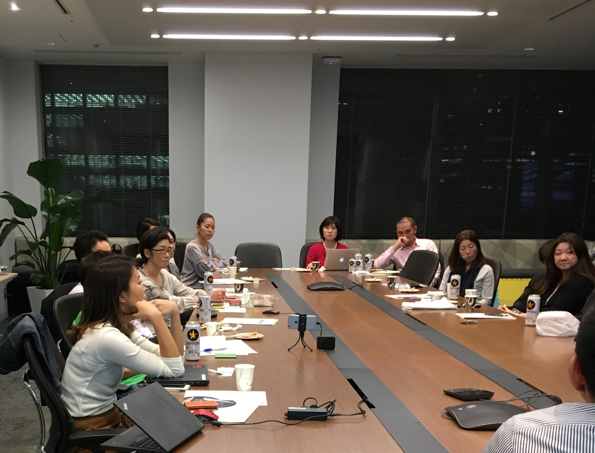

# Women in Localization Japan 第8回イベント

日時：2016年10月21日(金)19:00 ～ 21:30

開催場所：ネットアップ株式会社 会議室

## 翻訳支援ツール3社のパネルディスカッション
登壇者：田中 千鶴香/ Chizuka Tanaka/ 日本翻訳連盟理事

[Photos and Slides](https://drive.google.com/drive/folders/0Bw-Ig8iKIc_JN013V2NtSDhaUnM)

## SDL Trados Stuidioの変遷

登壇者：佐藤 弦/ Gen Sato/ SDL ジャパン社

Studio 2011〜2014〜2015〜2017で実装された機能拡張をご紹介いただいた上で、代表的な最新機能をご紹介いただきました。

「upLIFT Fragment Recall」によって翻訳メモリを断片的にも活用し、「AdaptiveMT」によって機械翻訳エンジンを学習させる方法を解説いただきました。

## クラウド型翻訳支援ツール MEMSOURCE 〜翻訳環境の共有化と品質向上で業務効率化〜
登壇者：加藤 じゅんこ/ Junko Kato/ メムソース社

一般的な翻訳環境の変化を紹介いただいた上で、2010年代の現代ではクラウド型CATやAPI連携が活用されていることが指摘されました。クラウド型でのメリットとして、1.効率的なアカウント運用、2.シンプルな操作性、3. プロジェクトや言語資源の共有化の簡易さ挙げられました。

## OmegaTのススメ
登壇者：アーロン・マドロンケイ/ Asron Madlon-Kay/ Ripple社

FOSS（Free, Open-Source Software）であるOmegaTの特色や利用方法だけでなく、翻訳者や運用者にとってのメリットなども幅広く紹介していただきました。OmegaTは参加型のコミュニティでもあるとのことで、サポートもボランティアによって実施されているとのこと。カスタマイズ開発については独自の成果を公開することも、有償で依頼することも可能だそうです。
