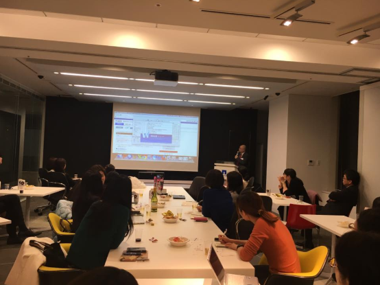

# Women in Localization Japan 第10回イベント

日時：2017年02月17日(金)19:00 ～ 21:30

開催場所：ネットアップ株式会社 会議室

第10回イベントでは当日のキャンセルなく、多くの参加者がありました。

[Photos and Slides](https://drive.google.com/drive/folders/0Bw-Ig8iKIc_JbVQzZXViRXZoUDQ)

## ニューラルネットワーク機械翻訳（NNMT）概要
登壇者：平野 幸治/ Koji Hirano/ 株式会社メディア総合研究所

自社の機械翻訳に対する取り組みを紹介いただいた上で、ニューラルネットワークの特徴を説明してくださいました。機械翻訳の代表的な方式やそれぞれの特長や、対訳コーパスから機械翻訳エンジンを学習させる方法、さらには機械翻訳が抱えるジレンマや、学習が妨げられる要因についても説明してくださいました。また、設定方法も含め、翻訳支援ツールとの連携についても具体的にご案内いただきました。

## 顧客企業別のテーラーメイド自動翻訳システム「T-400」（旧：熟考）のご紹介

登壇者： 山田 俊彰/ Toshiaki Yamada/ アクスビー株式会社

一般的な企業における翻訳業務の課題や要望、従来の自動翻訳ソフトが企業において抱えてきた理由などが紹介され、T400を活用することによる解決策を提示いただきました。世界で初めて採択された翻訳ロジックとして人工知能や、前後の文脈が判断されることによって実現する翻訳精度の向上が挙げられ、辞書については収録語数の多さのみならず分野が自動的に判別され、Wordなどの原文ファイルの形式は保たれたまま翻訳することが可能とのこと。T400はクラウド型サービスであるもセキュリティ対策も万全だそうです。
