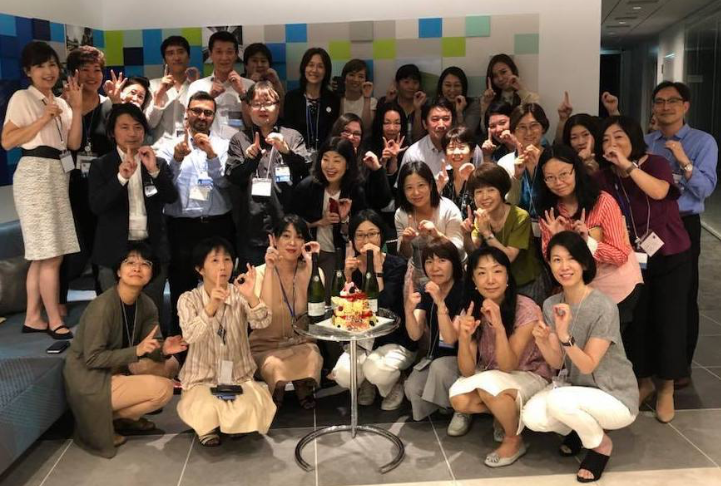
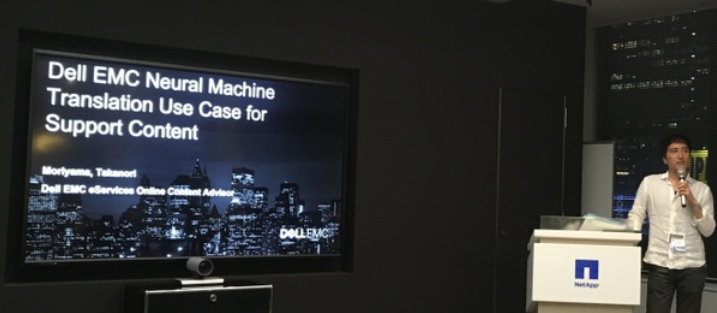

# Women in Localization Japan 第15回イベント

日時：2018年09月07日(金)19:00 ～ 21:30

開催場所：ネットアップ株式会社 会議室

第15回イベントは、米国加州でのWomen in Localization設立から10周年を祝してケーキとシャンパンで乾杯！

[Photos and Slides](https://drive.google.com/drive/folders/1ymELnxKteJ9varGSyXDqSoNz4EWIBT-2)

## Expedia's Journey with Machine Translation
登壇者：Claire Pagès and Tommaso Rossi/ Expedia Group

Women in Localization Japan Chapterとして初めて、海外に所在する講演者によるオンライン セッションを開催しました。

グローバルに活躍するオンライン旅行会社であるExpedia Groupでの機械翻訳に対する取り組みをイギリスに所在する担当者が紹介してくださいました。翻訳対象のコンテンツの種類や言語によっても機械翻訳エンジンを検討する必要があると指摘してくださいました。

## Dell EMCサポートコンテンツ翻訳におけるNMT導入事例
登壇者：森山崇範/ Takanori Moriyama/ Dell EMC

社外に対してWeb上で公開しているSupport Knowledgebaseの機械翻訳の利用について紹介してくださいました。人手翻訳、機械翻訳（+ 事後編集）など、コンテンツの種類などによる使い分けを紹介してくださいました。また、品質評価にはTAUS DQFを使用しているとの言及もありました。
