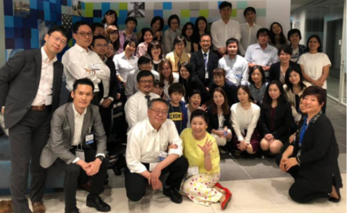
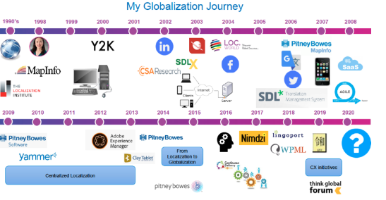
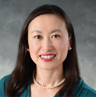
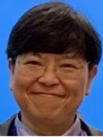
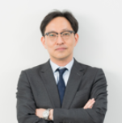

# Women in Localization Japan 第18回イベント

日時：2019年5月31日(金)19:00 ～ 21:30

開催場所：ネットアップ株式会社 会議室

令和に改元されてから初めてのWomen in Localization – Japan Chapterのイベントが開催され、今回も数多くの参加者を迎えた。

## Globalization Transformation – How will we define our future? 
登壇者：Yuka Kurihara / Pitney Bowes （米国からオンライン参加）

ニューヨーク現地時間では早朝にも関わらず、栗原氏は世界規模のテクノロジーカンパニーでの20年におよぶローカリゼーション業務の経験に基づいた講演をしてくれた。最初のスライドにはExperience、Mindset、Skillsと大きく描かれていた。この3つのバランスが大事ということだ。

埼玉県出身の栗原氏が初めて外国語を意識したのは小学校1年生のときだった。高校卒業後に米国へ留学し、現地にて大学に入学し、ソフトウェア会社に就職した。その後、勤務先は現職のPitney Bowesに買収され、翻訳に関連する業務においても翻訳管理システムを導入したり、マーケティング部からのローカリゼーション需要が新たに増えたり、LocalizationチームからGlobalizationチームへと変遷してきたとのこと。そのような中でも、Client Journeyをより良くしていけるように、また、初心に戻ることも大切にと心がけているそうだ。

長く業務に携わっていると多様な変化に出くわすこともある。栗原氏は、変化は恐れるのではなく、良い方向へ行こうと前向きに考えることが大事だと力説してくれた。たとえば機械翻訳の登場という大きな変化についても、翻訳業務が減るのではと不安を抱くのではなく、従来よりも効率的に作業ができるはずだからほかの作業をするための時間がもてるのではないかと発想する。

栗原氏は常に自分に魅力をかけることが必要とも指摘した。唯一無二であること、言語や文化、そしてテクノロジーに敏感であることなど。勤務先では自分に対する開発プランを立てることが推奨されており、理想的な自分となるために必要な勉強を考えるそうだ。Globalization Leaderになりたいというような大きな目標を掲げるばかりではなく、ソーシャルメディアをスマートに使いこなすといった目標でも十分に取り組むべき価値は見出される。変化を新しいチャンスととらえ、Experience、Mindset、Skillsを磨くことを忘れず、さらに自分にご褒美をあげることも忘れずにと強調した。

Give yourself a big hug!という素敵なフレーズで講演をしめくくる際、栗原氏はさらにもう一言付け加えてくれた。「自分にも、隣の人にも。」と。

## 「ローカリゼーションの資産管理のベストプラクティス」 全員参加ディスカッション
### テーマセッター

- 奥野 文子/ Ayako Okuno / Moravia IT s.r.o
- 佐藤 弦/ Gen Sato/ SDLジャパン株式会社
- 三笠 綱郎/ Tsunao Mikasa/ 株式会社 十印

### モデレータ
森 みゆき/ Miyuki Mori/ Women in Localization Japan – Assistant Chapter Manager

Women in Localization - Japan chapterでは2019年のテーマとして『Eco System - for Further Collaboration』（バイヤー、LSPの垣根を超えた関係性を築くことでエコシステムに導く）を掲げている。そこで、翻訳業界での豊富なご経験を誇る3名をテーマセッターとして迎え、クライアント、翻訳会社、その他関係者にとって必要なローカリゼーションの資産とはなにか、また資産はどのように管理するのかについて、当日のイベントに参加した全員でのディスカッションを繰り広げた。

三名のテーマセッターには、自己紹介とともに各自が考える資産管理を簡単に述べてもらったところ、以下のような回答があった。

佐藤氏：あまりこだわるべきではなく、手段の一つ。

三笠氏：TM（翻訳メモリ）やMT（機械翻訳）は道具。あくまでも良い翻訳をつくるための道具。

奥野氏：人が一番の資産。

このほかに資産として言及されたものを列挙すると、用語集、スタイルガイド、リンギスティック リファレンス、コーパスなどが言及された。しかしながら、たとえば「辞書」は辞書ごとに内容が異なっており、どの辞書が必要かという質問が提起されもした。

そもそも「翻訳資産」というのは、翻訳のコスト削減を前提にしているという指摘もあった。TMこそが一番の資産という意見も聞かれた。しかしながら、TMに縛られているという意識が伴い、ワード単価がより安価な90%のあいまいマッチを使わされるという感覚を否めないことがあるそうだ。TMに含まれる「ダメ翻訳」を排除する必要性を感じるという意見がある一方、クライアントが好む「ダメ翻訳」を排除してはならないという意見も聞かれた。統一性の必要もあり、単にTMのみを保持・蓄積するのではなく、メタデータも含めたバイリンガルファイルを保管する必要性も言及された。

クライアント エデュケーションの必要性や、クライアントと適正なコミュニケーションが取れる担当者の重要性も指摘された。これはさらに、翻訳会社内の実務担当者と営業担当、大手マルチ ランゲージ  ベンダーと委託先となるシングル ランゲージ ベンダーとの間などにおいても意識共有が重要であるとの意見が取り交わされた。

TMを蓄積していく上では管理が必要であり、短期間で古くなるTMの管理が必要であるか、保守費用は見合うものであるか、管理するタイミングについても疑問の声が上がった。

さらには、クライアントによる管理は十分ではないという意見も、翻訳会社に一任する傾向も強く見られるという声もあった。

たとえば機械翻訳では大量のコーパス（≒ 翻訳メモリ）が必要とされ、必ずしも洗練された一貫性のある訳文ばかりとは言えないこともある。ごく一部のみでもデータを磨き上げることは可能であり、これに合わせてエンジンのチューニングは可能と考えられているという指摘もあった。

## 登壇者プロフィール
### 栗原由香
Yuka Kurihara

Pitney Bowes

Director of Globalization

Yuka Kurihara is Director of Globalization at Pitney Bowes, where she leads the company’s localization/globalization operations.

With a double major in Computer Science and Linguistics, Yuka felt right at home fixing double-byte bugs early in her career before joining Pitney Bowes in 2007. As a native of Japan, her language and cultural background have been indispensable for expanding the company’s presence in Asia. Today, she’s responsible for leading the overall globalization strategy, architecture and process.

When Yuka is not at her desk, you’ll likely find her rocking a local Zumba class (she’s a certified instructor) or exploring new foods in restaurants and in her kitchen in upstate New York.

### 奥野 文子
Moravia IT s.r.o

Moravia Linguistic Services APAC グループマネージャー

1980年代後半から、テクニカルライティングを振り出しに翻訳者、ターミノロジスト、リンギスト、ランゲージグループマネージャなど様々なロールでローカリゼーション業界におけるランゲージサービスに携わる。2011年にリンギストとしてMoraviaに入社し、2016年より現職。

### 佐藤 弦
SDLジャパン株式会社

営業ディレクター

1999年にローカリゼーション業界に入り、翻訳者、校閲者、翻訳リソース管理、翻訳チーム管理などさまざまな業務を経験。その後10年間、国内・海外の両方の顧客の多種多様なプロジェクトに関わる。翻訳支援ツールの教習、ポストエディットによる機械翻訳の援用、欧州言語プロジェクトの品質管理、スタイルガイドの作成など通常の翻訳プロセスから離れた業務も多く行う。2009年よりSDLジャパンに翻訳ソフトウェアの営業として入社。翻訳会社の顧客を中心に営業活動を行う。SDL Trados Studioの機能を分かりやすく伝えることをテーマにしたブログの執筆やセミナーでの講演も多く行う。2017年に営業ディレクターに就任。ローカリゼーションのマーケット拡大をテーマとして、社内の教育活動や販売促進活動を行う。また、業界イベントなどでも、ローカリゼーション業界の展望などをテーマにした講演を積極的に行っている。

### 三笠 綱郎

株式会社 十印

クオリティ マネージャー

日立製作所でシステム開発に携わった後、1990年代半ばローカリゼーション業界に入り、ベルリッツ、ITP、SDLにて翻訳サービスのプロセス標準化や品質管理、翻訳チームのマネジメントに従事。途中フリーランス翻訳者も経験し、ITを中心としたさまざまな分野の翻訳に携わる。現在は株式会社十印にて品質管理プロセスの強化・改善とともに最新のMT技術の導入に取り組んでいる。
