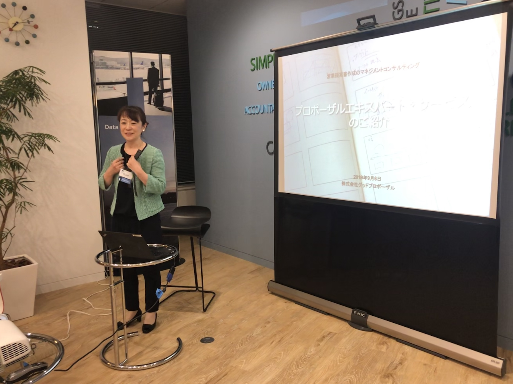

# Women in Localization Japan 第19回イベント 

日時：2019年5月31日(金)19:00 ～ 21:30

開催場所：ネットアップ株式会社 会議室

[Photos and Slides](https://drive.google.com/drive/folders/1WhaFatMhhD5pJbXWyjNDQMBQazuJjxe_)

## 外資系企業におけるプロポーザルエキスパートサービス
登壇者：水嵜 清美氏/ Kiyomi Mizusaki/ 株式会社グッドプロポーザル

水嵜氏自らが経営する会社では、営業提案書の作成支援を業務としている。提案書は大まかに以下の3つに区分できるそうだ。
1. 通常提案書：コンペや入札以外の段階での提案
2. 汎用提案書：業種などが限定された複数の顧客に対して同じ内容を提案
3. 回答提案書：RFP、RFIの要件に回答

営業担当やシステム エンジニアなどがこういった文書を作成する作業を支援するとのこと。水嵜氏が長年にわたって勤務してきた外資系の企業では、このような文書作成支援をしていると社内で宣伝する必要があったという。「勘のいい」営業担当者からは即座に反応が得られ、大型案件を獲得するためのコラボレーションが実現したそうだ。また、スピード感をもって提案書を書くことができるという触れ込みで営業チームを訪れると、盛大な歓迎を受けたとのこと。

提案書を充実させるといっても内容は多岐にわたる。入札提案書を作成する上で必要とされている要素が網羅されているかといった基本事項の順守ばかりではなく、図表といったビジュアルが求められ、メリハリのあるレイアウトやデザインについてはブランディングを考慮した配色までが重要視される。マルチカントリーな現場では、国によって求められる提案書の要素も異なる傾向があり、テキスト分量が多くストーリー展開が主要となる米国向けの提案書がある一方、日本向けの提案書では一般的な内容は不要と指摘を受けることもある。

AIやクラウド化が浸透しつつある昨今、水嵜氏も生産性の向上を目指しているそうだ。テレワークによる時短、コミュニケーションのバーチャル化、制作プロセスのアジャイル化など、時代に伴う変化を敏感に感じ取り、有用なツールを導入して率先して業務に取り組んでいる水嵜氏のさらなる活躍に期待したい。

## 「事後的翻訳から事前的翻訳 〜合成翻訳とオーサリングメモリーの試み〜」
登壇者：柳 英夫/ Hideo Yanagi/ 株式会社システートソリューションズ

「翻訳しない翻訳会社」を標榜する柳氏は、自らが取り組んでいるテクノロジー開発を紹介してくれた。ごく簡単には、テキストの整形・分解・分類・合成などの独自技術を使用し、翻訳しなければならないテキスト量を減らすというのである。それによって、品質の向上、スピードの改善、さらには全体的な効率化にもつながるという。

ソース文書が作成されて翻訳が実行されるまでの一般的な流れとしては、入力→校正→抽出→翻訳といったフローが容易に想像されるのではないだろうか。柳氏の提案手法のフローでは、入力→変形→抽出→前整形→分解→分類→翻訳→合成→後整形といったいくつものステップに細分化される。オーサリングメモリによる入力補完や、執筆規制などを組み合わせれば、より良い翻訳を導き出すこともできる。

一例として挙げられた「料理名翻訳文法」に従うと、料理名は、調味、調理法、素材、料理といった要素に分解されるという。メニューに見られる「ブルターニュ産 オマール海老のコンソメゼリー寄せ キャヴィアと滑らかなカリフラワーのムースリーヌ」などといった料理名を翻訳しなければならないときのことを想像してみて欲しい。柳氏のテクノロジー開発の根底にはテキスト処理と自然言語処理があるそうだ。機械的にテキストが分解され、蓄積されたテキスト要素のメモリと照合され、原文の執筆が支援されつつ、原文が完成される際には訳文も導き出される。言語によって複雑な冠詞・格変化などがある場合は、後整形で調整する必要があるとのこと。また、オーサリングメモリーを活用するための専用エディタも開発中だそうだ。

このような手法を開発するためにはドメインの専門家の重要性が指摘された。いわゆる用語管理者といったレベルではなく、俯瞰的に幅広く料理名を網羅しているような専門家の存在が必要であるとのこと。今後のさらなる発展を楽しみに感じた参加者が多く見受けられた。

## 登壇者プロフィール
### 水嵜 清美
株式会社 グッドプロポーザル
代表取締役・コンサルタント

20年以上にわたり企業の各種ドキュメントやコンテンツを制作。パソコン業界等で企業の製品マニュアル、販売ガイド、販促物やWebサイトの企画制作等を担当。電子マニュアルチームリーダー。その後提案書作成のエキスパートに転じ、国内外のIT企業にて、グローバル企業から公共、中小企業まで、多様な顧客向け提案書作成を担当。提案書チーム全体で毎年150件余に対応。

不定期に提案書作成企業研修、「プロポーザルエキスパート®」サービス等を提供。

2019年より日本商工会議所PC検定 プレゼン資料作成分野のセミナーを実施。

### 柳 英夫
株式会社 システートソリューションズ

代表取締役 兼 チーフコンサルタント

翻訳業界歴２５年以上。フリーランス翻訳者としてキャリアをスタートし、その後多国籍翻訳会社でのオペレーションマネジメントの経験を経ながら、TRADOS をはじめとする翻訳支援ツールや翻訳管理システムの導入支援コンサルティングに従事。最初の 10 年間は英語から日本語へのローカライズの効率化をテーマに活動していたが、現在は日本企業をクライアントとして、日本語から英語、英語から多言語の翻訳展開を技術面、システム面から支援する活動を進めている。株式会社システートソリューションズ代表取締役。
