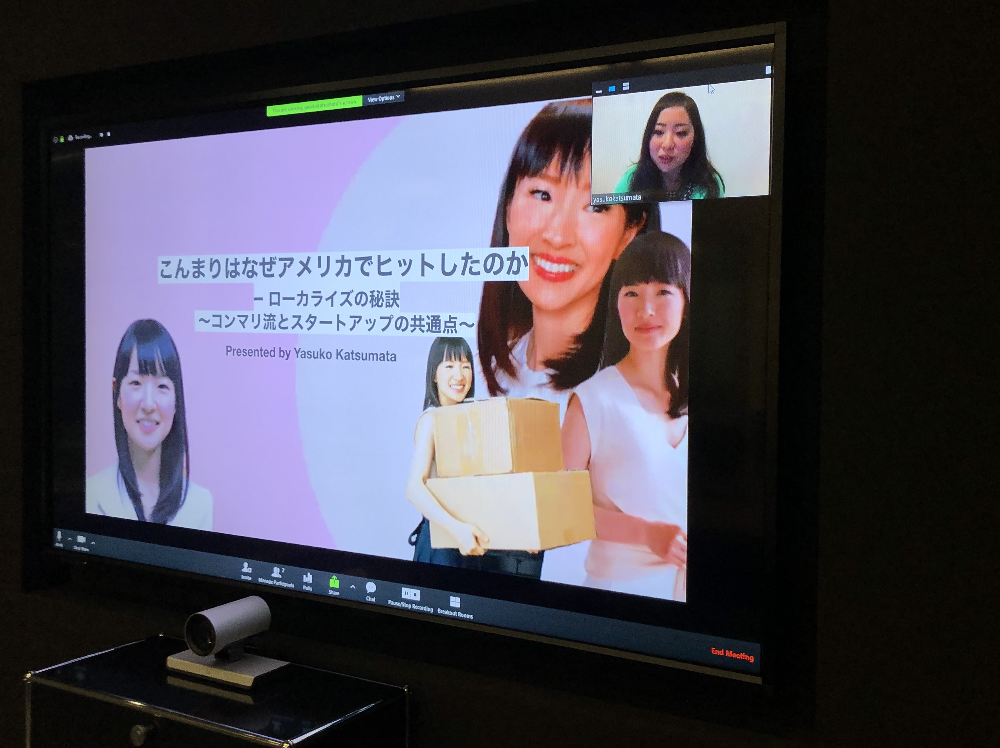

# Women in Localization Japan 第21回イベント 

日時：2020年2月14日(金)19:00 ～ 21:30

開催場所：ネットアップ株式会社 会議室

[Photos and Slides](https://drive.google.com/drive/folders/1-BjU9NBrDzHRu2qiiM-kb-nmbTFSpSNJ)

## 「こんまりはなぜアメリカでヒットしたのか – ローカライズの秘訣 ～コンマリ流とスタートアップの共通点～」
登壇者：勝間田 靖子 / Kiyomi Mizusaki/ btrax, Inc.社（サンフランシスコからリモート登壇）

略歴：新卒で外資系製薬会社へ入社。社内ITの管理・運用からITによる働き方改善などに約3年間、従事。留学のために退職。アメリカ・サンフランシスコにてInternational Marketingの修士号を取得。
卒業後は、サンフランシスコのエクスペリエンスデザイン会社、btrax, Inc.に入社。
マーケティングスペシャリストとして大手企業のアメリカ進出マーケティング、ローカライゼーションなどを担当。

参考記事：https://blog.btrax.com/jp/konmari-localization/

## 「ローカリ部門のない会社で見えてきたLSPとのパートナーシップ」
登壇者：小野理恵 / ファイア・アイ株式会社

